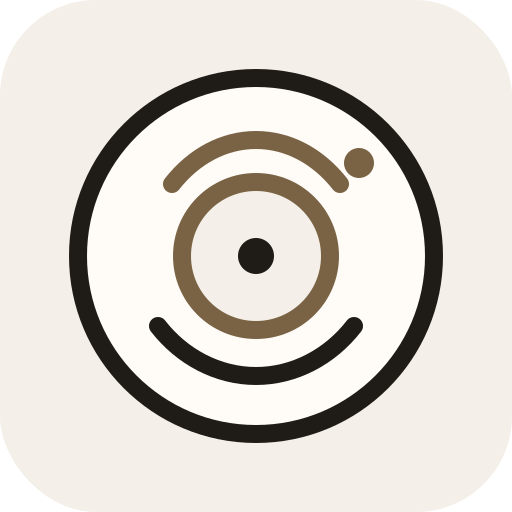

<p align="center">
  
</p>

<h1 align="center">Daily Spin</h1>

<p align="center"><strong>LOVE IT AGAIN</strong></p>

A quiet daily companion for people who actively care about the music they listen to.

Daily Spin sits one layer above Spotify. It helps you rediscover music from your own library, track new releases from artists you explicitly care about, capture song recommendations before they disappear, and keep playlists from drifting away from their original feel.

No social feed. No streaks. No generic discovery firehose. Just a small, careful room for your music.

## What It Does

- Surfaces a daily recommendation from your synced Spotify library.
- Lets you randomize the daily pick when your library is large.
- Plays tracks inside the app with a mini player, expanded player, and shuffled queue.
- Shows recent releases from your personal artist watchlist.
- Suggests watchlist artists from your saved tracks.
- Saves song recommendations into a capture inbox for later triage.
- Monitors playlists for drift, staleness, and abandonment.
- Suggests small playlist repairs using audio-feature fingerprints.
- Leaves room for Spin Companion, a Claude-powered chat layer grounded only in your music data.

## Brand

Daily Spin is built around a simple promise: **love it again**.

The app is not trying to replace Spotify. It sits above your library and helps you return to music you already care about, notice releases from artists you choose, and keep playlists feeling intentional.

The logo combines a small daily ritual mark with a spinning record: quiet, circular, and personal.

## Current Status

Daily Spin is in active local implementation.

Working now:

- Next.js App Router scaffold with TypeScript.
- Tailwind design system with ambient CSS variables.
- Supabase schema migration for the v1 data model.
- Feature-module structure from the docs.
- Spotify OAuth with playback scopes.
- Spotify library backfill into Supabase.
- Saved tracks, recent plays, playlists, watchlist artists, and release sync.
- In-app Spotify Web Playback SDK player.
- Daily pick generation and randomization.
- Artist watchlist manager on `/setup`.
- Playlist health overview and curation screen.
- Capture inbox UI and basic capture route.
- Morning Pick scoring algorithm with tests.

Still evolving:

- Claude/Spin Companion runtime calls.
- Production-grade recurring sync scheduling.
- Playlist mutation actions.
- Deeper recommendation explanations.

The full product spec lives in [`docs/`](docs/). Start with [`docs/index.md`](docs/index.md).

## Tech Stack

- **App:** Next.js 14, React, TypeScript
- **Styling:** Tailwind CSS, CSS variables for ambient theming
- **Data:** Supabase Postgres, RLS, SQL migrations
- **Music:** Spotify Web API
- **LLM:** Anthropic Claude
- **Tests:** Vitest
- **Package manager:** pnpm

## Getting Started

Install dependencies:

```bash
pnpm install
```

Create a local env file:

```bash
cp .env.example .env
```

Fill in Spotify, Supabase, NextAuth, and optional Anthropic values in `.env`.

Start the dev server:

```bash
pnpm dev
```

Open:

```text
http://127.0.0.1:3000
```

Use the same host in your Spotify redirect URI:

```text
http://127.0.0.1:3000/api/auth/callback/spotify
```

## Scripts

```bash
pnpm dev        # Start local development server
pnpm build      # Create a production build
pnpm start      # Run the production build
pnpm lint       # Run Next.js linting
pnpm typecheck  # Run TypeScript without emitting files
pnpm test       # Run Vitest unit tests
```

## Project Shape

```text
src/
  app/                 Next.js routes and API handlers
  modules/             Feature modules with public index.ts APIs
  lib/                 Cross-cutting infrastructure
  styles/              Global styles and Tailwind entrypoint
  types/               Shared TypeScript types

supabase/
  migrations/          SQL migrations for the database schema

docs/                  Product, architecture, module, and design specs
```

The module boundary rule is important: modules do not import from each other. Shared behavior goes through `lib/`, the database, or the Spin Companion tool dispatcher.

## Core Screens

- `/` - Morning ritual: pick, releases, capture inbox, playlist attention.
- `/setup` - Spotify connection, backfill, artist watchlist, and saved-track preview.
- `/playlists` - Playlist health overview.
- `/playlists/[playlistId]` - Curation view with fingerprint and suggestions.
- `/recap` - Weekly recap placeholder.

## License

To be decided before public release.
